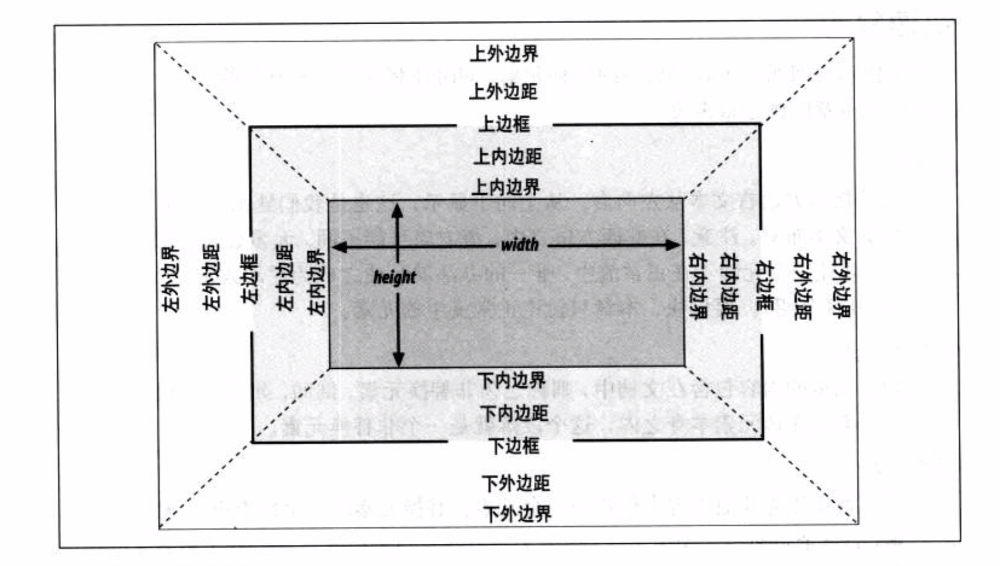

## 1.基础

-   CSS全称为“层叠样式表 (Cascading Style Sheets)”，它主要是用于定义HTML内容在浏览器内的显示样式，如文字大小、颜色、字体加粗等。

-   CSS的基本语法：

    -   选择符：表明该声明作用的位置；可以是元素标签，可以是类，可以是ID

    -   声明：由若干个键值对组成，键值对之间用`";"`号隔开，声明就是指明的样式；

    -   属性：

    -   值：属性具有多个值可以用空格分开；

    -   ```css
        P{
            color:red;
            font-size:12px;
        }
        ```

-   注释：`/* 这是注释信息 */ `

-   CSS 存放位置：1.单独文件；2.内联；3.嵌入

    -   单独文件：把样式写入单独的文件中，该文件以`.css `为扩展名，在`<head> </head> `中链接到HTML文件中；方法为：`<link href="xxxx.css" rel="stylesheet" type="text/css" /> `； rel代表同连接文件的关系，type代表资源类型，href资源地址；
    -   内联：将样式表直接写入现有的HTML标签中；`<p style="color:red">这里文字是红色</p> `；
    -   嵌入：嵌入式css样式必须写在`<style> </style>`之间，并且一般情况下嵌入式css样式写在`<head> </head>`之间。格式同单独文件；
    -   一般来说，样式的优先级：`内联式 > 嵌入 > 外部文件 `

## 2.选择器

> 什么是选择器：选择器指明样式的作用对象，也就是样式作用于网页中的那些元素；有：元素选择器、类选择器、ID选择器；

-   元素选择器：HTML代码中的标签，直接指定标签的样式；
-   类选择器：1.以英文圆点`. `开头；2.使用时，使用的标签属性添加` class="ClassName"`的属性；
-   ID选择器：1.以`# `开头；2.使用时，使用标签属性添加` ID="IDName" `的属性；

-   分组：多个选择器具有相同的属性，可以用`,`分隔；
-   多类选择器：`.class1.class2 {key: value;}`, 对同时包含制定类的元素添加额外属性；
-   属性原则器：选择具有某个属性的元素，`h1[class]`：选择具有class属性的h1标签，`a[href="/test"]`：具有属性href，且值为“/test”的元素标签；
    -   `[key^=xxx]`：以某属性开头
    -   `[key$=xxx]`：以某属性结尾
    -   `[key*=xxx]`：包含某属性
-   子选择器（包含选择器）：
    -   `.ClassName TabName 和 .ClassName>TabName `：采用`ClassName `类的元素的子标签(`TabName `)采用指定样式；
    -   两者区别：==带`> `号的只作用于元素的第一代后代，空格作用于所有后代== ；
-   兄弟选择器：`h1+p`,h1后的p标签；
-   通用选择器：选择器为` * `，表示 作用于所有标签元素；
-   伪类选择器：主要用于`a:hover{color:red;} `链接标签的鼠标滑过样式；
-   分组选择：当多个元素共同使用一个样式时，可用逗号分开多个元素；例如：`h1,span{color:red;} `,表示`h1 ,span`采用相同的样式；
-   选择器的权值：**标签的权值为1，类选择符的权值为10，ID选择符的权值最高为100**；
-   当权值相同时，**内联样式表（标签内部）> 嵌入样式表（当前文件中）> 外部样式表（外部文件中）**。
-   最高权值：例如：`p{color: red !important;} `

## 3.盒模型

>   html中的元素标签大体分为三类：块状元素、内联元素（行内元素）、内联块状元素；

-   **常用的块状元素有：**`<div>、<p>、<h1>...<h6>、<ol>、<ul>、<dl>、<table>、<address>、<blockquote> 、<form>` 
-   **常用的内联元素有：**`<a>、<span>、<br>、<i>、<em>、<strong>、<label>、<q>、<var>、<cite>、<code>`
-   **常用的内联块状元素有：**`、<input> `

### 1.特点比较

- **块级元素特点：**

    1、前后有换行;

    2、可以设置宽、高，边距等属性;

    3、内部可以包含其他块级元素，内联元素等；

    4、宽度默认是父级元素的宽度；高度可以设置，或者由内容高度决定；

- **内联元素特点：**

    1、和其他元素都在一行上;

    2、元素的高度、宽度及顶部和底部边距**不可**设置; 高度由`line-height `决定（不设置时由`font-size `计算得出），宽度由内容的多少决定，当宽度大于父元素的宽度时，内联元素会被折断到下一行；

    3、元素的宽度就是它包含的文字或图片的宽度，不可改变。

- **内联块状元素**：

    1、和其他元素都在一行上；

    2、元素的高度、宽度、行高以及顶和底边距都可设置。

### 2.盒模型



### 1.水平属性

-   一个盒子包括了content（实际内容）、border（边框）、padding（内边距）和margin（外边距）；
-   元素的总宽度等于: `margin-left + border-left + padding-left + width + padding-right + border-right + margin-right`
-   水平元素中：width，margin-left， margin-right 3个值可以设置为auto；后两者设为auto，width有固定宽度时会实现居中效果；
-   margin值可以为负，可以实现元素重叠或一些特色布局；

### 2.垂直属性

- 相邻的垂直外边距会重叠；边框和内边距不会；

### 3.margin 深入

####i.margin重叠

- margin重叠的特性：1.block水平的元素(不包括float和absolute元素)；2.不考虑writing-mode，只发生在垂直方向（margin-top/margin-bottom)；
- 存在于三种情况：
  - 1.相邻的兄弟元素：下面元素的`margin-top`和上面元素的`margin-bottom`会发生重叠，取大值；
  - 2.父级和 第一个或最后一个 子元素；
    - 父级元素`margin-top`重叠情况：
    - 父级元素`margin-bottom`重叠情况：
  - 3.空的block元素；
    - 空元素的上下margin值会发生重叠；
- 兄弟元素重叠：
  - 浮动后不会发生重叠；
- 父子重叠margin-top重叠条件：
  - 1.父元素非块状格式化上下文元素；
  - 2.父元素没有border-top设置；
  - 3.父元素没有padding-top设置；
  - 4.父元素和第一个子元素之间没有lnline元素分隔；
- 父子重叠margin-botton重叠条件：
  - 1.父元素非块状格式化上下文元素；
  - 2.父元素没有border-bottom设置；
  - 3.父元素没有padding-bottom设置；
  - 4.父元素和最后一个子元素之间没有lnline元素分隔；
  - 5.父元素没有height，min-height, max-height限制；

- 取值：正正取大值，正负值相加，负负最负值；
- 善用margin重叠，可以增加程序的健壮性；

## 5.布局模型

>   CSS布局模型：流动，浮动，层模型；
>
>   层模型：绝对定位，相对定位，固定定位；

### 3.position属性

- 可以有四种不同的值：`static, relative, absolute, fixed `

  - `relative`：相对定位； 相对于上一个位置，不会造成父级元素塌陷；

  - `absolute` ：绝对定位；绝对定位的参考物是其包含块。即相对于其包含块进行定位。也可以说：绝对定位的盒子是相对于离它最近的一个已定位的盒子进行定位的。

    > 包含块：某个元素的尺寸和位置往往是由该元素所在的包含块决定的，可以简单理解为定位参考框，或者坐标系；
    >
    > 浏览器选择根元素作为初始包含块；
    >
    > 1.对于`position: relative/staitc`的非根元素：包含块为最近的块容器祖先盒的`content `边；
    >
    > 2.对于` position: fixed`：包含块由连续媒体的视口或者分页媒体的页区建立；
    >
    > 3.对于`position: absolute` ：包含块由最近的`position `为` absolute `，`relative `或者` fixed `的祖先建立

  - `fixed`： 元素相对于浏览器窗口定位；注意包含块；

  - `relative` 


### 浮动

> 浮动元素脱离文档流，不占据空间，浮动元素碰到==包含它的边框==或者==浮动元素的边框==则停留。容纳不下时向下换行；
>
> 注意：元素浮动是从元素初始位置开始浮动。可以向左，向右，或不浮动，

- 浮动元素可能导致的问题：
  - 父元素的高度无法被撑开，影响同父级元素同级别的元素；
- 浮动特性：包裹和破坏；

## 6.单位

### 1.颜色值

-   英文名：如` red`；
-   RGB颜色：`rgb(133,45,200)`
-   十六进制颜色：其实就是RGB每一项的值由0-255变为十六进制的`0~ff `

### 2.长度值

-   px像素：
-   em：就是本元素给定字体的 font-size 值，如果元素的 font-size 为 14px ，那么 1em = 14px；如果 font-size 为 18px，那么 1em = 18px；
-   百分比：父级元素长度的百分比；

## 7.常用属性总结

### 1.格式化排版

- 字体：`font-family:"宋体";`
- 字号：`font-size:12px;`
- 粗体：`font-weight:bold;`
- 斜体：`font-style:italic;`
- 下划线：`text-decoration:underline;`
- 删除线：`text-decoration:line-through;`
- 段落缩进：`text-indent:2em;`
- 行高：`line-height:2em;`
- 字母间距：`letter-spacing:50px;`
- 单词间距：`word-spacing:50px;`
- 对齐：`text-align:center;`
- 字体：`font-family:"宋体";`

### 2.伪类

> 用于向某些选择器添加特殊效果；
>
> 语法：selector :pseudo-class{ ... }

- `:link` ：未访问的链接样式；
- `:visited` ：已被访问的链接样式；
- `:hover` ：鼠标指针移动到目标上；
- `:active`： 正在被点击的链接；
- `:focus`：向拥有键盘输入焦点的元素添加样式；​

## 8.弹性盒子(CSS3)

- 通过`display:fiex; 或 display:inline-flex`将元素设置为弹性容器;
- 

