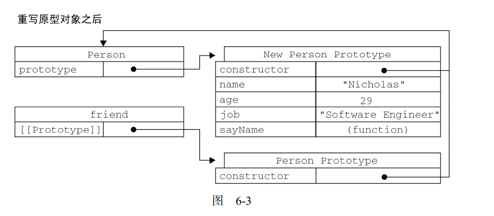

# I.基础

## 1.基础概念

> JavaScript 和 ECMAScript：
>
> - `ECMAScript`和`JavaScript`的关系: 前者是后者的规格, 后者是前者的实现; 一个完整的JavaScript实现包含：核心（ECMAScript，DOM，BOM）
> - 
> - DOM ：文档对象模型，用于HTML的应用程序编程接口， 把整个页面映射为一个多层节点解构，提供访问和操作网页内容的方法和接口；
> - BOM ：浏览器对象模型，访问和操作浏览器窗口；提供了与浏览器交互的方法和接口；
> - js通过`<script></script>`标签引入，src可以引入外部域的文件（可以用于跨域）

### 1.基本数据类型

> ECMAScript共有5种基本数据类型（`Undefined, Null, Boolean, Number, String` ）和一种复杂数据类型(`Object`, 一组数据和功能的集合)，使用`typeof`可以查看对象的类型；
>
> 基本类型为什么可以有属性和方法?：通过包装类实现；

- `Undefined` 类型：只有一个值，`undefined`，表示变量未声明或未初始化；
- `Null` 类型：只有一个值，`null`，表示一个空对象指针；如果对象声明用于将来保存对象，那么最好将该变量初始化为`null`;
- `Boolean`  类型：只有两个字面量，`true、false`；可以用`Boolean`转换，注意：==Object类型， 任何对象都会转换为true，只有null会转换为false==；
- `Number `类型：
  - 可以赋值为10进制，0开头的八进制，0x开头的十六进制的整数；
  - 可以赋值为浮点数；
  - `NaN`：非数值；类型属于Number，一个特殊值，用于表示本来要返回数值的操作数未返回的情况；
    - 1.与任何值都不相等，包括自身；
    - 2.与任何数的计算都为NaN；
    - 3.可通过`isNaN( )`判断是否为“数值”，能否“不是数值”，注意！！！如果能转为数值，则为false；
- `String`  类型：由`Unicode`字符组成的字符序列;
  - 字符串不可变;
- `typeof `和`instanceof`
  - `typeof a`：变量a的类型；一般只返回几个类型：`string, number, boolean, function, undefined`；
  - `a instanceof constructor`：测试原型和实例的关系；

### 2.包装类型

> ECMAScript 提供3个特殊的引用类型: `Boolean, Number, String`, 具有特殊的属性和方法, 便于操作对应的基本类型;
>
> 基本类型不是对象, 不能提供方法和属性, 为了便于操作, js提供了包装类型, 

- 后台自动完成一下处理, 以String为例:
  - 1.创建`String`类型的一个实例;
  - 2.在实例上调用指定方法;
  - 3.销毁实例;

- 包装类型同引用类型的主要区别在于生存周期： 引用类型的生存周期是从开始创建到离开作用域，而包装类型只存在于==一行代码执行的一瞬间，然后立刻销毁==；

  - ```javascript
    var a = 'a';
    a.a = 'b';
    a.a
    // undefined, 
    ```

- 一些易混点:
  - `var s1 = String('hello)`: `String()` 为转型函数, 将任意类型转为字符串; 
  - `var obj2 = new String('hello')`: 显示的创建包装类对象;

### 3.符号

> JavaScript符号基本同C相同；

- 不同点：
  - 1.`>>`有符号右移（可简单认为，符号位保留，然后移动）；`>>>` 无符号右移；（符号位参与移动，原位置补0）（总得到正数）；
  - 2.`===`全等和`==`相等：例如`'55'==55`会返回true，`'55'===55`会返回false；相等如果类型不同会按照相应规则做类型转换，而全等不做类型转换；
  - 3.`!==`不全等和`!=`不相等：

- 条件操作符号：`variable = booolean_expression ? true_value : false_value;`

### 4.语句

> 大部分同c相同：if...else..., while(), for(), break, continue, switch()...case:

- `for-in`语句：`for(x in l){ .....; }
  - 用于枚举对象的==属性== ；
  - 旧版本`for-in`用于值为`null, undefined`的对象会抛出异常(ES5之后的版本不会）；
- `for-of`语句：`for( x of l){ ... ; }
  - 用于遍历数组，取出值；
  - ES6 引入的特性，不能作用于普通对象；
- `label`语句：可以在代码中添加标签；`start: ...;`
- `with`语句：向代码的作用域设置到一个特定的对象中：`with (expression) statement;`(不建议使用)；

### 5.变量

- 变量可以包含两种不同数据类型的值：基本类型值和引用类型值；
  - 基本类型值：5种基本数据类型，按值访问；
  - 引用类型值：保存在内存种的对象，与其他语言不同，JavaScript不允许直接访问内存种的位置，所以，引用类型的值是按引用访问；
  - 通过变量赋值和函数传递参数时，将体现出差异；

### 6.执行环境

> JS中的一个重要概念，每个执行环境都有一个与之关联的变量对象，环境中定义的所有变量和函数都保存在这个对象中；解析器在处理数据时会使用该变量；
>
> 在web浏览器中， 全局执行环境就是 window对象；
>
> 每个函数也有自己的执行环境；

#### i.作用域

- JavaScript没有块级作用域；例如

  - ```javascript
    if （true) {
        var color = 'blue';
    }
    console.log(color);
    ```

- 变量提升：当变量被声明时，声明会提升到他所在函数的顶部；

  - JS引擎在进入作用域时会对代码分两轮处理。第一轮，初始化变量，第二轮，执行代码；

- js会自动向上层搜索，直到到全局作用域；应为js有`var`，所以能够知道到底是新声明还是调用；这同`python`略有不同；python需要改变其他作用域变量时需要`global`或`nonlocal`声明；

#### ii.执行环境

- 每当函数被调用，就会产生一个新的==执行环境==， 属于执行环境部分的变量和函数，被保存在==执行环境变量==中


## 2.引用类型和面向对象

> 在js中，**引用类型**是一种数据结构，用于将数据和功能组织在一起；类似于通常所说的类，但并不是相同的概念，对象为引用类型的实例。引用类型也称为 **对象定义**;
>
> 同其他面向对象语言的类的区别：**类**通常用于创建一类具有相同属性、方法的对象；

### 1.常用引用类型

- Object类型：使用较多的引用类型，主要用于存储数据（类似python字典）

  - 创建及使用：

    ```javascript
    /* 第一种创建方式 */
    var person = {
        name : 'xxx';
        age : 20;
    }

    /* 第二种创建方式 */
    var person = new Object();
    person.name = 'xxx';
    person.age = 20;

    console.log(person.name);               // 可以使用 点 取得属性值
    console.log(person['name']);            // 方括号取值，优点是可以通过变量取值
    ```

- `Array`类型：

  - 可以越界访问, 返回`undefined`; 如果赋值会改变数组大小;
  - `Array`的方法:
    - `Array()`: 两个及以上参数时返回由数值组成的数组等同于`.of()`, 一个参数时返回指定长度、成员值为`undefined`的数组;
    - `Array.of()`: ==ES6==, 将一组值转换为数组;
    - `Array.from()`: ==ES6==, 将可遍历对象和类似数组对象转换为数组;
  - 实例的方法:
    - `indexOf()`: 搜索指定元素的位置;
    - `slice()`: 切片;
    - `push(), pop()`：向尾部添加或移除元素;
    - `shift(), unshift()`：向头部添加或移除元素;
    - `reverse()`: 自身翻转;
    - `splice()`:  从指定索引处删除若干元素, 在添加指定元素;
    - `join()`: 将数组的每个元素都用指定字符串连接;
    - `fill()`: 用给定值填充数组;
    - `includes()`: 是否包含某个值, 给出起始位置;

- `Date`类型：

  - 创建时如果无参数则自动获取当前时间，如果根据特定日期和时间创建，需要传入毫秒数（UTC）；

- `RegExp`类型：正则表达式，`/pattern/ flags；` 模式`pattern`部分可以是任何正则表达式，`flags`用于标明正则表达式的行为；

- `Function`类型：函数是对象，函数名实际上也是一个指向函数对象的指针；

- 基本包装类型：为便于操作基本类型值，JavaScript还提供了3 个特殊的引用类型：`String, Boolean, Number`；当读取一个基本类型值的时候，后台就会创建一个对用的基本包装类型的对象，从而能够嗲用一个方法来操作这些数据；

  - 基本类型表达的应该仅仅是内存数据（值）；
  - 当调用基本类型相关的方法时，后台会自动完成：1.创建相关包装类型实例，2.在实例上调用指定方法，3.销毁实例；
  - 可以通过：`var stringObject = new String("hello world");`创建`String`类型；

- 其他：

  - `Global对象`：不属于任何其他对象的属性和方法，最终都是Global对象的属性和方法；终极兜底对象；
  - `window对象`：所有全局作用域中声明的变量、函数都会映射为` window`对象的属性和方法；
  - `Math`对象：

### 2.基本类型和引用类型对比

- 基本类型指的是简单的数据段，而引用类型指那些可能由多个值构成的对象。

- 基本类型的赋值为内存区域的拷贝，相互独立；引用类型的赋值为浅拷贝（复制的是内存区域是一个指针， 指向同一个引用类型对象；
- 在利用变量对变量赋值，或函数传入引用类型参数时。需要注意！！

### 3.面向对象

> 类：在其他面向对象语言中，类是一个可以创建任意多个具有相同属性和方法的一种特殊类型。
>
> JS中对象的定义：无序属性的组合，其属性可以包含基本值、对象或者函数；
>
> 每个对象都是基于一个引用类型创建的；

- 注意：==原型中的内容只有一份，所有实例通过指针指向，类似c++中静态成员==

#### 1.理解对象

>Object通常只用于构造单个对象；如果需要向其他语言一样创造特殊的构造函数这需要使用特殊的方法；

- 属性类型:
  - 数据属性：包含一个数据值的位置，在这个位置可以读取和写入值；可以通过`Object.defineProperty()`方法修改数据属性的特性值；
  - 访问器属性：不包含数据，但包含一对`getter`和`setter`函数，同个这两个函数处理数据；访问器属性必须通过`Object.defineProperty()`定义；

#### 2.创建对象

- JS有以下的几种创建构造对象方式：（常用的是：构造函数模式+原型模式）

  - 工厂模式：可以方便构造同类型对象，但无法解决对象识别；

    ```javascript
    function createPerson(name, age, job) {
        var o = new Object();
        o.name = name;
        o.age = age;
        o.job = job;
        return o;
    }
    ```

  - 构造函数：

    ```javascript
    function Person(name, age, job) {
        this.name = name;
        this.age = age;
        this.job = job;
    }
    
    // 使用方法
    var p = new Person(name, age, job);
    ```

    - 缺点：每个方法都要在每个实例上重新创建一遍；==虽然可以通过定义全局函数来解决，但违背了封装的宗旨==；

  - 关于`new`，当`new Foo(...)`执行时， 会发生一下事情：

    - 1.一个继承自`Foo.prototype`的新对象被创建；
    - 2.使用指定参数构造函数Foo，并将`this `绑定到新对象上。

#### 3.原型模式：

- > 每个创建的==函数==都会按照特定规则为该函数创建一个==`prototype`==的属性，这个属性是一个指针，指向==原型对象==，默认，原型对象都会自动获得一个`constructor`(构造函数)的属性，又指向该函数；
  >
  > 原型对象可以由包含所有实例共享的属性和方法；通俗讲：每个函数都有`prototype`属性，`prototype`指向一个对象，该对象的属性和方法被所有实例共享；
  >
  > ==实例会有一个`__proto__`的指针==指向原型对象；
  >
  > 

- 原型链的搜索机制：当以读取模式访问一个实例的属性时，首先会在实例中搜索该属性，如果没有找到该属性，则会继续搜索实例的原型对象；

- 可以通过实例访问原型对象的值，但是不能修改；当修改时，对在实例上创建该属性，并覆盖掉原先对象中的属性；

- 实例可以通过`hasOwnProperty()`方法检测一个属性是否在实例中；`in`检测一个属性在实例或原型对象中；`'name' in persion1`

  ```javascript
  function Person() {
  }
  // 重写原型对象
  Person.protorype = {
      name = 'xxx';
  	age = 26;
      sayname: function() {
      	alert(this.name);
  	}
  
  var p1 = new Person();
  ```

  

- 原型具有动态性（指针指向的一个对象，指针不变，但对象内容能动态变化）：任何对原型对象的修改都能动态的反映到所有的实例上；

- 原先对象对于属性为引用类型的会存在问题（可以动态变化，当实例中修改时，所有的实例属性都发生变化）

- ==构造函数模式+原型模式== 最为常见的方式

  - 构造函数模式用于定义实例属性；
  - 原型模式用于定义方法和共享属性；

#### 3.继承

- 原型链：构造函数都有一个原型对象（`prototype`），而实例都有一个指向原型对象的内部指针(`__proto__`)；如果让一个构造函数的原型对象等于另一个类型的实例，此时，原型对象（超类的实例）将包含指向另一个原型对象的指针，这就是原型链；

- js依靠原型链实现继承，`SubType.prototype  = new SuperType(); `

- 组合式继承：应用最广泛

  - ```javascript
    function SubType() {
        // 1.可以传参，2.直接在this中增加属性；将父类的属性写入子类中；
        SupperType.call(this);  
    }
    // 用于继承父类方法，（属性也会在prototype中在次包含，但是会被this中的覆盖）
    SubType.prototype = new SupperType();
    
    ```


## 3.函数

> 函数声明: `function sayHi() { alert('Hi') }`;
>
> 函数表达式:`var funcName = function () { alert('Hi') }`
>
> 解析器会率先读取函数声明, 并使其在执行任何代码之前可用; 至于表达式, 则必须等到解析器执行到所在的代码行, 才会被解释执行;

- 匿名函数：`function`关键字后没有标识符，也叫`lambda`函数；

- 立即调用的函数表达式 （自执行的匿名函数 ）：创建一个匿名函数并立刻执行；

  ```javascript
  (function(x) {
      console.log(x);
  })('hello world!');
  ```

### 1.函数基础

> 函数内部有两个特殊属性, `arguments, this`

- 没有重载：JavaScript 函数不能重载，同名函数会覆盖；
- ==ECMAScript函数不关心传递的参数个数， 类型等信息。所有的参数在内部以一个数组来表示，函数接收到底始终是一个数组；函数体内可以通过`arguments`对象来访问这个参数数组。注意，`arguments`表示的是函数调用时传递的参数， 而不是函数定时的参数==
- ==函数内部属性==：在函数内部，有两个特殊的对象，`arguments`和`this`；在函数内可做变量使用；
  - `arguments`：类数组对象, 包含传入的所有参数;
  - `this`：函数据以执行的环境对象，在网页全局作用域种调用函数时，this对象向就是window；
- `apply(), call()`：调用一个函数, 可以指定`this`值，二者仅参数形式不同
  - `apply(thisArg, [argsArray])`
  - `call(thisArg, arg1, arg2, ...)`
- `bind(thisArg[, arg1[, arg2[, ...]])`: 通过传入this和其他参数，生成一个新的函数；
- 函数名本身就是变量，所以函数也可以作为值来使用，可以将函数作为参数传递给另一个函数，函数本身也是对象，所以函数也具有属相和方法：
  - `length`：函数希望接受的命名参数的个数；
  - `prototype`：原型属性，指针，指向一个对象；该对象是包含可以由特定类型的所有实例共享的属性和方法；
  - `apply(), call()`方法：可以在特定的作用域中调用函数（可以把传递`this`参数）；

### 2.关于闭包

> 闭包：有权访问另一个函数作用域中的变量的函数；阻止垃圾回收器将变量从内存中移除，使在创建变量的执行环境的外部能够访问该变量；
>
> 创建闭包的常见方式，就是在一个函数内部创建另一个函数；
>
> 实现原理：一般函数执行完毕，局部活动对象就会被销毁，内存中仅保留全局作用域；但是闭包：内部函数会将__包含函数的活动对象__添加到它的作用域链中；闭包就可以访问包含函数的所有变量，并且由于匿名函数的引用，这些对象也不会销毁；（十分类似C语言函数内部用`static`声明；）

- 闭包包围的是变量空间，而非值；

### 3.关于this

> this指向函数执行时所在的环境变量；  [this原理](http://www.ruanyifeng.com/blog/2018/06/javascript-this.html)

```javascript
var obj = { foo: function() { console.log(this.bar) }, bar:1 }
var bar = 2;
var foo = obj.foo;

foo()       // 2, this指向Window
obj.foo()   // 1, this指向obj
```

### 4.立即执行函数

```javascript
(function () {
    do...
})();
```

## 4.BOM

> BOM 的核心对象是`window `,它表示浏览器的一个实例；它既是通过 JavaScript 访问浏览器窗口的一个接口，又是 ECMAScript 规定的` Global` 对象。
>
> 重要点：location.href 跳转，间歇调用和超时调用；

- 所有全局作用域中声明的变量、函数都会映射为` window`对象的属性和方法；
- 如果页面中包含框架（html的`frame`标签），则每个框架都拥有自己的window对象，并且保存在`frames `集合中;
- `top`对象始终指向最高（最外层）的框架（top 等于最外层框架的window)，也就是浏览器窗口；可以用`top.frames[0]`指向其他frame；

### 1.location对象

> 提供当前窗口中加载的文档有关的信息；既是`window`对象的属性，也是`document`对象的属性；
>
> 保存当前文档的信息，比较重要的就是通过`location.href `进行跳转、超时调用

- 对象属性：
  - `hash`：当前文档的hash（#号后的字符）
  - `host`：服务器名称和端口号；
  - `href`：设置或返回当前页的完整的URL；==设置后会直接跳转到新的URL上==；
  - `search`：设置或返回从问号（？）开始的URL（查询部分）；
- 对象方法：

  - `reload()`：重新加载当前文档；
  - `assign()`：打开新的url并在浏览器历史记录中生成一条记录；；
    - 同设置`location.href`属性（常用）或设置`winddow.location`效果相同
  - `replace()`：导航到相应的url，但不会在历史记录中生成；

### 2.间歇调用和超时调用

js为单线程语言，允许设置超时或间歇调用，使代码在特定时刻执行；

- 超时：`setTimeout(函数名，超时时间)`，超过指定毫秒数后，指定代码被执行；

  - `setTimeout()` 会返回一个数值`id `，可以用` clearTimeout(id)`来消除超时调用；

  - ```js
    timeoutId = setTimeout(function(){...}, 1000);     // `1000ms后执行匿名函数
    clearTimeout(id);									// 清除超时调用
    ```

- 间歇：`setInterval(函数名，间歇时间) `,每隔间隔时间，函数被执行；

  - `setInterval()` 会返回一个数值`id `，可以用` clearInterval(id)`来消除间隔调用；
  - 应尽量避免使用间歇调用；

### 3.系统对话框

- `alert() `：生成警告，仅向用户显示信息；
- ` confirm()`：确认对话框，将用户选择信息返回；
- `prompt()`：提示框，提示用户输入一些文本；

## 5.DOM

> 文档对象模型，是针对HTML和XML文档的一个API。DOM描绘了一个层次的节点树，允许开发人员添加，移除和修改页面的某一部分。
>
> ==document== 对象是HTMLDocument的一个实例，表示整个HTML页面；
>
> DOM操作往往是js中开销最大的部分，应尽量避免DOM操作

### 1.节点层次和类型

- 所有标记页面表现为一个特定节点为根节点的树形结构；HTML页面的根节点为`document`
- ==元素节点向下包括：属性节点、文本节点、其他元素节点.==..
- 所有的节点类型，JS中以`Node`类型实现；每个节点由`nodeType`定义其属性；
- `nodeType`：
  - 元素标签类型（1）
  - 属性类型（2）
  - 文本类型（3）
  - 注释类型（8）
  - `Document`根节点类型（9）
- `nodeName` ：不同类型的节点，名称意义不同
  - 元素节点的 `nodeName `是标签名称（大写）
  - 属性节点的 `nodeName` 是属性名称
  - 文本节点的 `nodeName `永远是 `#text `
  - 文档节点的 `nodeName` 永远是 `#document `
- `nodeValue` ：
  - 对于文本节点`nodeValue`是文本信息；
  - 对于属性节点`nodeValue`是属性值；
  - 对于元素节点`nodeValue`始终是null；
- 节点关系：
  - `childNodes`属性，保存着NodeList对象，NodeList用于保存一组有序节点；可以向数组一样访问其中元素，基于DOM结构动态执行查询结果。还有`firstChild、lastChild`指向第一个、最后一个子节点；
  - `parentNode`属性，指向其父节点；
  - `previousSibling`属性，指向前一个兄弟节点；
  - `nextSibling`属性，指向后一个兄弟节点；
- 通过关系操作节点：
  - `appendChild()`，向子节点末尾插入一个节点；
  - `insertBefore()`，向指定节点前插入一个节点；与之成为兄弟节点；
  - `replaceChild()`，替换子节点；

### 2.document 节点

> `document` 对象是`HTMLDocument` 的一个实例，表示整个HTML页面；`document`对象是`window`对象的一个属性；

- 提供文档信息
  - `document.body`属性：指向`<body>`元素节点；
  - `document.doctype`属性：指向`<!DOCTYPE>`标签；
  - `document.title`属性：该页面标题；
  - `document.URL`属性：该页面完整的URL，例如`http://www.wrox.com/WileyCDA/`；
  - `document.body`属性：改页面的域名，例如`www.wrox.com`；
- 提供节点创建删除
  - `document.createElement('div')`：创建一个元素节点，参数为元素的节点名;
  - `document.createTextNode('xxx') `：创建文本节点，参数为需要插入节点中的文本；
- 节点的查找
  - `document.getElementById()`：通过id查找指定节点；
  - `document.getElementsByTagName()`：通过标签名查找节点，返回一个nodeList；
  - `document.getElementsByName()`：通过name查找节点，一般用于选定一组节点；

> tips:对于`http://mail.163.com/index.html`
>
> http：指协议；
>
> mail：服务器名；
>
> 163.com：域名，用于定位网站的独一无二的名字；
>
> http://mail.163.com/index.html：url，统一资源定位符；

### 3.Element 类型节点

- 重要属性
  - `id`：获取或设置元素的id值；
  - `className`：获取或设置元素的类名；
  - `innerText`：内部文本信息，（注意，可能是子节点的文本信息）；
  - `innerHTML`：内部HTML信息；
  - `attributes`：属性节点的动态集合；
- 重要方法
  - `.getAttribute('xx')`：获取指定属性的值；
  - `.setAttribute('xxx', 'xxx')`：设置指定属性指定值；
  - `.removeAttribute('xxx')`：删除指定属性；

### 4.DOM扩展

- `querySelector()`：接受一个css选择符，返回第一匹配到的元素；
- `querySelectorAll()`：接受一个css选择符，返回一个NodeList对象；
- `getElementsByClassName()`:
- `dataset`：HTML5规定，可以为元素添加非标准的属性，但是要添加前缀`data-`，可以通过dataset以键值对映射的形式访问；
- `innerHTML`：内容被解析为 DOM 子树，替换调用元素原来的所有子节点；

## 6.事件

### 1.事件流

- 事件冒泡：事件开始由最具体的元素（文档中嵌套层次最深的那个节点）接收；然后沿DOM树向上传播，事件在每级节点上都会发生，直到传播到document对象；
- DOM2级事件”规定的事件流包括三个阶段:==事件捕获阶段==、==处于目标阶段==和==事件冒泡阶段==。

### 2.事件处理函数

- HTML事件处理程序：直接写在HTML中的事件处理程序；

- `DOM0`级事件处理程序：将一个函数赋值给事件处理程序属性；

  ```javascript
  var btn = document.getElementById("myBtn");
  btn.onclick = function(){
      // 使用DOM0级方法指定的事件处理程序被认为是元素的方法，程序中的this引用当前元素
      alert(this.id)
  	alert("Clicked");
  };
  ```

- `DOM2`级事件处理程序：`addEventListener(), removeEventListener()`，所有 DOM 节点中都包含这两个方法，并且它们都接受 3 个参数:==要处理的事件名==、作为==事件处理程序的函数==和一个==布尔值==。最后这个布尔值参数如果是 true，表示在捕获阶段调用事件处理程序;如果是 false，表示在冒泡阶段调用事件处理程序。

  ```javascript
  var btn = document.getElementById('myBtn');
  btn.addEventListener('click', function(){alert('click')}, false);
  ```

- 通过`DOM0`级和`DOM2`级，this指向该元素；通过HTML添加的事件处理程序，`this`指向`window`

### 3.事件对象

> 在触发 DOM 上的某个事件时，会产生一个==全局的事件对象 event==，这个对象中包含着所有与事件有关的信息。包括导致事件的元素、事件的类型以及其他与特定事件相关的信息。在事件处理函数内可以直接访问event对象；
>
> 只有在事件处理程序执行期间，event 对象才会存在;一旦事件处理程序执行完成，event 对象就会被销毁。

- 事件对象属性：
  - currentTarget：当前事件处理程序所在那个元素；
  - `target`：触发事件的目标元素；
  - `type`：事件类型；
  - `stopPropagation()`：阻止事件继续向上冒泡；
  - `preventDefault()`：阻止默认行为；
  - `clientX, clientY`: 鼠标坐标；
- UI事件
  - `load`：当页面完全加载后会触发；
  - `resize`：浏览器窗口调整大小时触发；
  - `scroll`：滚动；
- 焦点事件
  - `blur`：元素失去焦点时触发；
  - `focus`：元素获得焦点时触发；
- 鼠标与滚轮事件

  - `click`：单击鼠标按钮时触发；

  - `mousemove`：鼠标指针在元素内部移动时重复的触发；

  - `mouseenter`：鼠标光标从元素==外部==首次移动到元素范围内时触发；

  - `mouseleave`：位于元素上方的鼠标移动到元素范围外时触发；

  - `mouseleave`：位于元素上方的鼠标移动到另外一个元素时触发；

  - `load`：当页面完全加载后会触发；

## 7.错误与调试

### 1.异常捕获

- `try...catch`...finaly：一场捕获和处理；

  ```javascript
  try{
  // 可能会导致错误的代码 
  } catch(error){
  // 在错误发生时怎么处理 
  } finally{
  // 都会执行的代码部分
  }
  ```

- `throw`：抛出异常，可以是任何类型，也可以是`new Error('message')`;

### 2.调试技巧

- `console`：向终端输出信息；
  - 输出信息方式：`error, log, info, warn`;
  - 分组输出：`console.group('第一组信息'); console.groupEnd('第一组信息')；`
  - `console.dir()`：将对象以树形结构展现；
  - `console.dirxml()`：显示某个节点的HTML/XML代码；
  - `console.time(); console.timeEnd()`：显示代码运行时间；
  - `console.table()`：表格化显示；


## 8.AJAX和序列化

### 1.AJAX

> 基于XMLHttpRequest，实现ajax:

```javascript
//创建和发送请求
xhr.open();
xhr.send();
//在收到响应后，响应的数据会自动填充 XHR 对象的属性；readyState：表示请求响应过程的当前阶段；status：响应状态；
// 也可在open前 设置 onreadystatechange，实现异步请求
xhr.onreadystatechange = function(){
if (xhr.readyState == 4){
    ...
}
```

- 1.JQuery, $.ajax()

  ```javascript
  $.ajax({
      url: 'xx',
      method: 'POST',
      data: '',
  })
  ```

- 2.Axios:

  ```javascript
  // axios GET 请求事例
  axios.get('/user', {
      params: {
        ID: 12345
      }
    })
    .then(function (response) {
      console.log(response);
    })
    .catch(function (error) {
      console.log(error);
    });
  ```

- 3.fetch.js

### 2.JSON

- 序列化：将`JavaScript`对象转为`JSON`字符串：`JSON.stringify(xxxx)` ；
- 反序列化：将`JSON`字符串转为`JavaScript`对象： `JSON.parse(xxx)` ；

## 9.扩展

### 1.localStroage，sessionStorage

> HTML5中，新加入了一个localStorage特性，主要用来作为本地存储，解决了cookie存储空间（每条cookie 4K）不足的问题，一般浏览器支持5M大小的空间；
>
> localStorage与sessionStorage的唯一一点区别就是localStorage属于永久性存储，而sessionStorage属于当会话结束的时候，sessionStorage中的键值对会被清空 

- `localStorage.getItem()`：读取值；
- `localStorage.setItem()`：存储值；
- `localStorage.clear()`：清除所有；
- `localStorage.removeItem()`：清除指定；

# II.ES6

> 出于兼容性考虑, es6可以通过 `Babel` 转码为ES5 

## 1.局部变量和常量

> var声明的变量无块级作用域, 具有变量提升特性(先使用,后声明, 解析器会自动将声明提到开始处)

- `let`: 创建块级作用域变量;
  - 不存在变量提升, 必须先声明再使用;
  - 在相同作用域内,不允许重复声明;
  - 暂时性死区: 声明的变量绑定这个区域, 不受外部的影响;
- `const`: 声明常量;
  -  `const`保证的是变量指向的那个内存地址不变, 而内存地址上的值则可能随着类型不同而不受控制, 需要注意;
  -  `const`声明变量也具有块级作用域;
  -  类似`let`, 形成暂时性死区;
- 顶层对象
  - 浏览器环境是`window`对象, 在Node指`global`对象, 

##  2.解构赋值

- 数组/ `Iterator`接口的解构赋值

  ```javascript
  let [a, b, c] = [1,2,3] // a=1, b=2, c=3
  let [a, ...b] = [1,2,3] // a=1, b=[2,3]
  let [a, b=4] = [1] //默认值, a=1, b=4
  ```

- 对象的解构

  ```javascript
  let {a, b} = {a:'aaa', b:'bbb'} // 不同于数组, 对象解构只key有关, 与顺序无关
  let { foo: baz } = { foo: 'aaa', bar: 'bbb' }; // 也可变量名(baz)与匹配模式(foo)不一致, baz = 'aaa'
  ```

## 3.函数

#### 1.默认值

- `function log(x, y="world"){...}`
- 函数的`length`属性: 返回没有指定默认值的参数的个数;

#### 2.箭头函数

- `()=>{}`: `var f = v => v; 等同于 var f = function (v) { return v }`

- 注意点:

  1. 函数体内的`this`对象, 就是==定义时所在的对象, 而不是使用时所在的对象==; *扩展: this剖析*
  2. 不可以当做构造函数, (不可以使用new命令), 否则抛出错误;
  3. 不可以使用`arguments`对象, 不可以使用`yield`命令;

#### 3.rest参数 (`...变量名`) 

- 用于获取函数的多余参数,  变量作为一个数组, 将多余参数放入;

  ```javascript
  // values 为一个数组, 多余参数都放入其中
  function add(...values) {
      ...
  }
  ```

## 4.数组扩展

- 扩展运算符(spread): `...`, 类似`rest`参数, 将一个数组转为逗号分隔的参数序列;

  ```JavaScript
  var a = [1,2,3];
  console.log(...a) // 等同于 console.log(1,2,3) ==> 输出 1 2 3
  ```
  - 复制数组: `var b = [...a]`;
  - 合并数组: `[...a, ...b]`;
  - 可用于字符串, 用于分解字符串;
  - 可用于任何提供`iterator`的接口;

- `Array.from()`: 将类似数组对象(array-like)和可遍历对象转换为真正的数组;

- `Array.of`: 

## 5.对象扩展

- 允许直接写入变量和函数, 作为对象的属性和方法,

  - ```javascript
    var a = 'a'
    var obj = {a, method(){console.log('method')}} 
    ```

- `Object`新增方法:

  - `Object.assign()`: 方法用于对象的合并

### 4.`for...of VS for...in`

- `for...of`: 遍历迭代器;
- `for...in`: 遍历对象属性;

### 5.Spread/Rest操作符

- `let a=[1,2,3]; foo(...a)`: 会将迭代器展开, 元素作为参数传递到函数中;
- `(...a)=>{console.log(a)}`: 将传入的操作合并为一个可迭代对象;

## 6.Module语法

> 模块功能主要由两个命令构成: `export`和`import`;
>
> `export`用于规定模块的对外接口; `import`用于输入其他模块提供的功能;

#### 1.`export `: 输出

> 一个文件就是一个独立的模块, 如果希望该模块的变量在外部能够获取, 必须使用`export`关键字输出, `export`可以输出变量, 函数, 类等;
>
> `export`不能处于块级作用域内;

- ```javascript
  // 方式1
  export var firstName = 'liu'
  
  // 方式2
  var firstName = 'liu'
  export {firstName}
  
  ```

#### 2.`import`: 加载模块

> 通过`import`加载其他模块`export`的变量,函数, 类等;
>
> `import`的变量都是只读的, 不允许在加载模块的脚本里改写;
>
> `import`具有提升效果, 会提升到整个模块头部, 首先执行;

- ```javascript
  import {firstName [as xxx]} from "./profile.js" // 通过as关键字对导入变量进行重命名
  ```

- `import * as xxx from './xxx.js'`: 整体加载, 名称为`xxx`, 通过`.`访问具体变量;

- ==`export default`: 为模块指定默认输出== ; 
  - 其他模块加载该模块时, `import`命令可以指定任意名称, 且也不需要大括号;
  - 一个模块只能用一个默认输出;
  - `export default`就是输出一个叫做`default`的变量或方法, 等同于`export {xx as default}`

- ==`require, exports, module.exports, export, export default`==:

  - `require`: node和es6都支持的引入;
  - `export/ import` : es6 支持的导出引入;
  - `module.exports exports`: 只有node支持的导出;

#### 3.export和import复合写法

```javascript
export {foo, bar} from 'my_module';

// 可简单理解为, 写成一行后, foo和bar并没有导入到当前模块中, 只是相当于转发
import {foo, bar} from 'my_module';
export {foo, bar};
```

## 7.编程风格

- 字符串

  - 静态字符串一律使用单引号或反引号, 不适用双引号. 动态字符串使用反引号;

- 解构赋值

  - 函数参数是对象成员, 优先使用解构赋值;

  - 如果函数返回多个值, 优先使用对象的解构赋值, 而不是数组的解构赋值, 方便更改返回值和返回值顺序;

    - ```javascript
      function test(input) {
          return {left:xx, right:xx, top:xx, bottom:xx};
      }
      const {left, right } = test(input);
      ```

- 对象

  - 单行定义的对象, 最后一个成员不以逗号结尾, 多行定义的对象, 最后以逗号结尾

  - ```JavaScript
    const a = {k1: v1, k2:v2};      // 单行, 不以逗号结尾
    const b = {                     // 多行, 以逗号结尾
        k1: v1,
        k2: v2,
    }
    ```

  - 对象定义后不应该随意增加新属性, 如果不可避免, 需要使用`Object.assign`方法

- 数组

  - !! 使用扩展运算符(...)拷贝数组, `const itemCopy = [...items]`;
  - 使用`Array.from()`将类似数组的对象转为数组;

- 函数

  - 优先使用箭头函数,`(() => { console.log('hello');})(); `
  - 合适场合使用新特性rest运算符`...`, 默认参数;

- 模块

  - 使用es6语法支持的模块导入导出 , 避免使用node语法的模块导入导出;
  - 如果模块默认输出一个函数, 函数名首字母应该小写; 默认输出一个对象, 对象首字母大写;
  - 
## 日常开发记录

- 调试JS时无法找到动态加载的JS源文件：在文件开头或结尾加上`//@ sourceURL=xxx.js`，就可以在no domain中找到需要调试的文件；