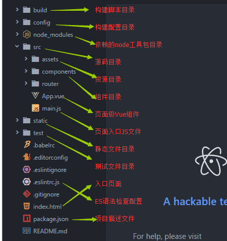

## 1.Vue基础概念

### 1. Vue实例

```js
var vm = new Vue({
    el: "#n_id",
    data: {
        name: 'xxx'
    },
    // 声明周期钩子, create
    create: function () {
        console.log('xxx');
    }
})
```

- 是一个new出来的Vue对象；通过特定属性，指定挂载点，内容，数据等信息；

### 2.组件

> 可复用的Vue实例，且带有一个名字；

### 3.相关工具

- `vue-loader`: webpack的一个loader，允许用户以单文件组件（SFC）的格式创作Vue组件；[参考](https://vue-loader.vuejs.org/#what-is-vue-loader)

    - ```html
        <template>
            <div><div>
        </template>
                
        <script>
            export default {
                
            }
        </script>
        
        <style> </style>
        ```

- 

- `vue-devtols`：浏览器插件，

- `vue-cli`: vue开发标准工具，用于快速构建vue项目；

    - ```shell
        # 安装 webpack webpakc-cli vue-cli
        npm install webpack webpack-cli -g
        npm install vue-cli -g
        
        vue init webpack project_name
        # 按照提示，选择
        # Project name (baoge)： -----项目名称
        # Project description (A Vue.js project)： ----项目描述
        # Author ()： ----作者
        # Runtime + Compiler: 运行加编译
        # Runtime-only: 仅运行时，已经有推荐了就选择第一个了
        # Install vue-router? (Y/n) 是否安装vue-router
        # Use ESLint to lint your code? (Y/n) 是否使用ESLint管理代码
        # Setup unit tests with Karma + Mocha? (Y/n) 是否安装单元测试
        # Setup e2e tests with Nightwatch(Y/n)? 是否安装e2e测试
        
        # 会自动生成项目目录，然后cd 到项目目录，按照相应的包
        cd ./project_name
        npm install
        # 启动
        npm run dev
        # 打包
        npm run build
        ```

        

### 4.模板语法

- 文本: `{{ msg }}`
- 原始HTML: `<div v-html="rawHtml"></div>` --> `<div> xxxxxx </div>`
- 作用于特性: `<div v-bing:id="dynamicId"></div>`

> 以上都支持JavaScript表达式

## 2.创建实例过程中的选项

### 1. [选项(数据)](https://cn.vuejs.org/v2/api/#%E9%80%89%E9%A1%B9-%E6%95%B0%E6%8D%AE)

> ==如果在数据对象中使用箭头函数, this的指向将不会按照期望指向Vue实例==, 参看es6, 匿名函数

#### 1.data

> 组件的定义只接受function

- 以`_, $`开头的属性不会被`Vue` 实例代理, 
- 以一个组件被定义, `data` 必须声明为返回一个初始数据对象的函数; 因为组件可能被用来创建多个实例。如果 `data` 仍然是一个纯粹的对象，则所有的实例将**共享引用**同一个数据对象;

#### 2.computed

> 计算属性, 数据值由计算得到, 注意:==如果计算属性使用箭头函数, 则`this`不会指向这个组件的实例,不过可以通过将例作为函数的第一个参数来访问; `aDouble: vm=>vm.a*2`==

- 计算属性的结果会被缓存，除非依赖的响应式属性变化，才会重新计算；

- ```javascript
    new Vue({
        data: {
            a: 1
        },
        computed:{
            aDouble: function() {
                return this.a * 2
            }
        }
    })
    ```

#### 3.methods

- 放置事件处理的相关函数;

#### 4.watch

> 通过键值对的形式,监控某个数据, 当数据（键）变化时, 调用对应的方法.

- 形式可以为一个函数，或一个对象；对象形式可以对操作进行配置：
    - `handler`：监听到数据变化时调用的方法；
    - `deep`：深度监听，当对象属性变化时也能监听到；
    - `immediate`：监听开始后立刻调用；
- 当需要监听对象的某个属性变化时，也可以把key写为`'obj.xx'`，避免使用deep，导致较大的开销；

#### 5.props

- 参考 组建 > props

### 6.propsData

- 创建实例时传递 props，主要作用是方便测试；

### 2.[选项（DOM）](https://cn.vuejs.org/v2/api/#%E9%80%89%E9%A1%B9-DOM)

#### 1.el

- 提供一个在页面上已存在的`DOM`元素作为`Vue`实例的挂载目标. 可以是一个CSS选择器, 也可以是一个`HTMLElement`实例; 
- 如果实例化时存在这个选项, 实例会立即进入编译过程, 否则, 需要显示调用`vm.$.mount()`手动开启编译.

#### 2.template

- 将会替换挂载的元素;

#### 3.render 渲染函数

- 字符串模板的替代方案, 接收一个`createElement`方法作为第一个参数来创建`VNode`

  > ```javascript
  > document.createElement(tagName [, options]);
  > ```

#### 4. renderError

- 开发者环境中工作, 遇到错误时, 提供另外一种渲染输出; 

### 3.选项（生命周期）


- 创建：`beforeCreate，create`
- 挂载：`beforeMount，mounted`
- 更新：`beforeUpdate：数据更新；updated：由于数据更改导致的虚拟 DOM 重新渲染和打补丁`
- `activated`:
- `deactivated`:
- 销毁：`beforeDestory，destoryed`:
- `errorCaptured`: 捕获子孙组件的错误时被调用.

### 4.选项/资源

### 5.选项/组合

- `parent`：指定已创建的实例之父实例，在两者之间建立父子关系。子实例可以用 `this.$parent` 访问父实例，子实例被推入父实例的 `$children` 数组中。
    - 尽量避免使用，推荐用 props 和 events 实现父子组件通信；

### 6.选项/其他

- `name`: 组件名称;
- `functional`: 使组件无状态(无data)无实例(没有this上下文);
- `model`: 允许自定义组件在使用 `v-model` 时定制 prop 和 event名称；

-----

## 3.实例的属性和方法

> 以`$`开头，

### 1.[实例属性](https://cn.vuejs.org/v2/api/index.html#%E5%AE%9E%E4%BE%8B%E5%B1%9E%E6%80%A7)

- `vm.$data`：实例观察的数据对象；
- `vm.$root`：当前组件树的根 Vue 实例；
- `vm.$children`：当前实例的直接子组件；
- `vm.$parent`：父实例，如果当前实例有的话；
- `vm.$refs`：一个对象，持有注册过 [`ref` 特性](https://cn.vuejs.org/v2/api/index.html#ref) 的所有 DOM 节点元素或VUE组件实例；

### 2.方法

- `vm.$watch('xx', (new_v, old_v)=>{})`：观察 Vue 实例的一个表达式或计算属性函数值的变化，回调函数得到的参数为新值和旧值；
    - 并且会返回一个取消观察函数，用来停止触发回调；

- `vm.$emit('eventName', [...args])`：触发当前实例上的指定事件, 并将产生传递个接收器;
- `vm.$on('eventName', callback)`：监听指定事件；
    - `vm.$once()`：只处理一次；

- `vm.$forceUpdate()`：强制vue组件重新渲染；
- `vm.$nextTick(callback)`：(vue是异步渲染，更新的值只有等到渲染时，才会显示出来）将回调延迟到下次 DOM 更新循环之后执行；

## 4.[指令](https://cn.vuejs.org/v2/api/#%E6%8C%87%E4%BB%A4)

> 指令都是以`v-`开头
>
> 修饰符 (Modifiers) : 是以半角句号 `.` 指明的特殊后缀，用于指出一个指令应该以特殊方式绑定; 

### 1.v-bing, 特性绑定, 简写为`:`

> 动态地绑定一个或多个特性，或一个组件 prop 到表达式;

#### 1.绑定`class`

```html
<!-- 单个绑定 -->
<div :class="oblClassA"></div>
<!-- 对象语法: 由 isActive 值决定 active 是否存在 -->
<div v-bind: class="{active: isActive}"></div>
<!-- 数组语法 -->
<div :class="[classA, classB, 'class1']"></div>
```


- 对象语法: `<div v-bind: class="{active: isActive}"></div>`, 由`isActive`决定`active`是否存在;
  - 也可以将整个`{xx}`对象作为一个参数, `<div v-bind: class="classObject"></div>`, 由决定具体类;
- 数组语法: `<div v-bind:class="[activeClass,  errorClass]"></div>`: 对数组中值进行赋值;

#### 2.绑定其他属性

```html

<!-- 使用js表达式拼接 -->

<my-component :prop="someThing"></my-component>
```


### 2.v-if  & v-show 条件渲染

> v-if 决定节点是否存在, v-show决定节点是否显示;
>
> v-if 有更高的切换开销, v-show 有更高的初始开销;

#### 1.v-if 

- 根据表达式的值的真假条件渲染元素。

- ==`v-if`==: `<span v-if="isExist"></span>`;
- ==`v-else`==: `<span v-if="type === 'A'">A</span> <span v-else>B</span>`
- ==`v-else-if`==: `<span v-if="type==='A'">A</span> <span v-else-if="type='B'">B</span> <span v-else>C</span>`
- 当同`v-for`共同作用时, `v-for`有更高的优先级; `v-if`将分别作用于每一个`v-for`循环中;

#### 2.v-show

- 根据表达式之真假值，切换元素的 `display` CSS 属性。

- `<div v-show="ok">hello</div>`

### 3.v-for 列表渲染

> 可作用于: String, Array, Object, number
>
> number: ==循环出 1到指定数;==
>
> Object: ==循环出所有属性值;==

- 列表的循环: `v-for="item in items"` 或者 `v-for="(item, index) in items"`
- 对象的循环: `v-for="value in item"` 或者 `v-for="(value, key) in item"` 或者 ` v-for="(value, key, index) in item"`
- 可以为渲染出的DOM增加唯一标识key: `<div v-for="item in items" :key="item.id">
    - 当在次循环时，如果存在指定key的DOM，Vue就会复用该DOM节点，而不是重新创建，这样，开销较小；（一般都是用值，而不是用index或key）

### 4.v-on 事件处理, 简写为'@'

> 绑定事件监听器。事件类型由参数指定。表达式可以是一个方法的名字(`@click=functionName`)或一个内联语句(`@click=functionNane(xxx, xx), 或 @click=alert('hello')`)，可以跟修饰符(`例如.stop`);
>
> 作用于元素dom可以监听原生DOM事件, 在==自定义元素组件上==可以监听==自定义事件==

- 修饰符: 
  - `.stop`: 停止向上冒泡;
  - `.self`: 本身触发;
  - `.once`: 只触发一次回调;
  - `.left`: 点击左键时触发;
  - `.right`: 点击右键时触发;
- 也可以监听自定义事件

### 5. v-model 双向绑定

> 在表单控件或者组件上创建双向绑定，它会根据控件类型自动选取正确的方法来更新元素；本质上不过是语法糖，它负责监听用户的输入事件以更新数据，并对一些极端场景进行一些特殊处理；

- 可以作用在: `<input>, <select>, <textarea>, components（自定义组件） `

- 作用于组件：

    - 一个组件的`v-model`默认会利用名为`value`的`prop`和名为`input`的事件；只要在组件内实现，1.props.value, 2.数据变化时触发`input`事件，并将值作为参数抛出；即可实现组件的v-model；

    - 可以定义`model`的选项，定义prop的名称，和事件名称：

        ```javascript
        Vue.component('xx', {
            model: {
                prop: 'value_xx',
                event: 'change'
            }
        })
        ```

        

### 6.v-html

> 更新元素的 `innerHTML`，**内容按普通 HTML 插入 - 不会作为 Vue 模板进行编译**

```html
<div v-html="html">
    
</div>
```

### 7.v-once

> 只渲染元素和组件**一次**

## 5.组件

> 组建也是`Vue`的实例, 具有一些特殊点：1.定义时，data 必须为函数, 返回一个数据对象； 2.具有组件名；
>
> ？ 为什么data需要一个函数，返回一个数据对象：注册组件的本质其实就是建立一个组件构造器的引用，使用组件才是真正创建一个组件实例。所以，注册组件其实并不产生新的组件类，但会产生一个可以用来实例化的新方式。
>
> 组件名：推荐 PascalCase (首字母大写命名)的命名规则；在html中引用时，采用kebab-case (短横线分隔命名) 的方式引用；

### 1.组件注册

- 全局注册: `Vue.component('ComponentName', {/* 对象 */})`
  - 注册后, 可以用于任何新创建的`Vue`根实例中, 也包括组件树的所有组件的模板中.
  - `Vue.component('ComponentName')`:获取组件构造器; 
- 局部注册
  - 1.通过`JavaScript`对象定义组件: `var ComponentA={/* 对象 */}); `
  - 2.通过实例中的`components` 注册: `new Vue({components:{'ComponentA': ComponentA}})`:
  - 局部注册的组件在其子组件中不可用;
- 在模块系统中局部注册:
  -  `import ComponentA form './ComponentA'`;
- 基础组件的自动化全局注册: 

### 2.props

> 组件在被外界引用时，外界可以影响或传入组件的数据；该值只能传递给组件，组件不能修改；

- Prop名可以采用PascalCase (首字母大写命名)，在引用组建时，采用kebab-case (短横线分隔命名)；

- 传递Prop时, 都默认为String类型, 如果需要传递数字, 布尔等需要绑定，让vue去解析出需要的值：

    -  `<blog-post :likes="42"</blog-post>`
    -  `<blog-post :likes="true"</blog-post>`

- 单向数据流: prop是用来向组件传递一些数据，组件自身不能修改此数据，如果需要将数据通知到调用者，一般可以采用一下方式：

    - 定义一个函数，通过子组件进行触发：给组件绑定某个函数，在组件内合适时机进行触发`vm.$emit()`；

- prop验证: 通过对象, 指定prop的类型, 

  ```javascript
  props:{
      propA: Number, 
      propB:{
        	// 数据类型  
          type: Number, 
          // 是否必要
          required: true
     	}, 
      propC:{
          // 定义验证方法
          validator(){}
          // 默认值
          default(){}
      }
  }
  ```

### 3.自定义事件

- 跟组件名和prop不同, 不会将驼峰命名转换为短横线分割命名, 并且由于HTML大小写不敏感, 所以`v-on:myEvent 转换为 v-on:myevent`导致事件不能被监听, 推荐使用 短横线命名;

- 通过`this.$emit('my-event')`: 
- `.sync`

### 4.内置组件

- `component`: 渲染一个“元组件”为动态组件。依 `is` 的值，来决定哪个组件被渲染。

  - ```html
    <!-- 动态组件由 vm 实例的属性值 `componentId` 控制 -->
    <component :is="componentId"></component>
    ```

- `keep-alive`: 抽象组件, 不会渲染为DOM节点, 用`<keep-alive>` 包裹动态组件时，会缓存不活动的组件实例，而不是销毁它们. 

### 5.插槽

> 用于接收组件标签之间传入的内容

- 当组件没有定义`<slot>`标签的元素时, 任何传入的内容都会被丢弃;
- 具名插槽: 当希望定义多个可接收的插槽时, 可以` <slot name="header"></slot>`指定插槽的名字;
  - 当传递内容时, 需要指定`<div slot="slotName"></div>`, 或整体用`<template slot="slotName">`包裹;
- 组件在定义时, 可以在内部指定内容;

## 6.全局API

### 1.`Vue.extend()`

- 使用基础 Vue 构造器，创建一个“子类（VueComponent）”，可以用这个子类直接构建vue实例；

- ```javascript
    // 创建构造器
    var Profile = Vue.extend({
      template: '<p>{{firstName}} {{lastName}} aka {{alias}}</p>',
      data: function () {
        return {
          firstName: 'Walter',
          lastName: 'White',
          alias: 'Heisenberg'
        }
      }
    })
    // 创建 Profile 实例，并挂载到一个元素上。
    new Profile().$mount('#mount-point')
    ```

- 

## 命名规则

- 自定义组件名: 字母全小写且必须包含一个连字符; 当使用驼峰命名时例如(MyComponentNmae), 引用时可以引用`<my-component-name> 也可 <MyComponentName>`;
- prop: 
- 自定义事件名: 短横线命名, 