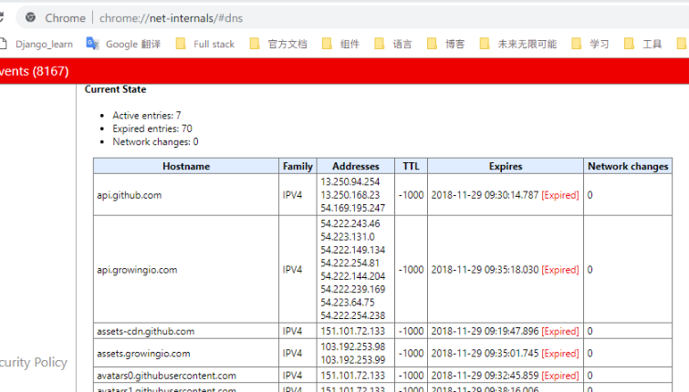

## 1.基础

### 1.基础概念

#### 1.URL

- 统一资源定位符；格式为：`protocol://hostname[:port]/path`;

- `protocol`协议，常见的有``file(file:///), http, https, ftp, thunder(迅雷)`;
- `hostname`主机名，指存放服务器的域名或IP，如`www, 127.0.0.1`

#### 2.域名

- 例如`www.example.com`

- 根域名：如例中域名，真正的域名是`www.example.com.root 或简写为 www.example.com.`
- 顶级域名 TLD：根域名的下一级，例如，`.com, .net`
- 次级域名 SLD：顶级域名下一级，例如上面的`eaxmple`，用户可注册；
- 主机名：用户在自己的域里为服务器分配的名称，如`www`表示提供WEB服务的主机，用`ftp`表示提供ftp服务的主机，用 `mail`表示提供邮件服务的主机；

#### 3.`session`

> HTTP协议是无状态协议，本身不支持服务端保存客户端信息，由于无状态记忆的特点，此次连接无法得到上次连接的状态，`session`就是用来表示标识用户、跟踪用户的。在WEB开发中，服务器可以为每个用户浏览器创建一个会话对象（session对象），注意：一个浏览器独占一个`session`对象(默认情况下)。因此，在需要保存用户数据时，服务器程序可以把用户数据写到用户浏览器独占的`session`中，当用户使用浏览器访问其它程序时，其它程序可以从用户的`session`中取出该用户的数据，为用户服务。

- `session`一般保存于服务器中；
- `session`的关键在于服务器得到正确的`session id`
- 实现方式有：通过Cookie保存`session id`、URL重写（把session id直接附加在URL路径后)；
- 面临问题：服务从单服务到多服务会面临session共享问题，

#### 4.Cookie

> 服务器给客户端发的一个「通信证」，存储于客户端，用户访问时，服务器通过通行证就能确定用户身份，从而采取相应操作；

- Cookie属性：name, value, maxAge(失效时间), domain(可以访问的域名) ...
- 作用：自动登陆（在Cookie失效前，验证是否登录过，登录过就可以直接成功登录），记录用户未登录时的信息；

#### 5.`JWT`:json web token，

> 为了在网络应用环境间传递声明而执行的一种基于JSON的开放标准。
>
> JWT声明一般用来在身份提供者和服务提供者间传递被认证的用户身份信息，以便于从资源服务器获取资源。

- JWT：按照格式将信息进行加密，前端请求通过`Authorizatio`头部信息携带token发送后端，后端直接用key解密得到相关信息；
  - 前端在向服务器发送请求时，需要用Javascript取出JWT（可以存放在cookie，localStorage，sessionStorage中），再放入header中发送请求；
- JWT格式：
  - 头部header：包含声明和加密算法`{"type": "JWT", "alg": "HS256"}` ；-->编码为Base64
  - 载荷`playload`：存放有效信息的地方，（标准声明，公共声明，私有声明）-->编码为Base64
  - 签证`signature`：将编码后的头、编码后的载荷、secret，连接进行加密；

#### 6.HTTP请求方式

> HTTP 版本不同，包含方式也不同，1.1版本包括以下内容
>
> 副作用：发送一个请求后，资源状态发送改变就是有副作用，不变就是无副作用；
>
> 幂等：一个请求发送N次和M次，服务器资源状态最终一致，就是幂等；例如修改，

- `GET`：请求指定页面信息，并返回实体主体；
- `HEAD`：类似get请求，只是返回的响应中没有具体的内容，用于获取报头；
- `POST`：副作用，非幂等；提交数据进行处理请求 ，用于建立，修改等操作；
- `PUT`：副作用，幂等；
- `DELETE`：请求服务器删除指定内容，返回码：200，202，204
- `OPTIONS`：用于查询服务器性能；
- `TRACE`：回显服务器请求，主要用于测试或诊断；

#### 7. 浏览器缓存 [参考](https://juejin.im/entry/5ad86c16f265da505a77dca4)

> 浏览器每次发起请求, 都会在浏览器缓存中查找该请求的结果以及缓存标识;
>
> 浏览器每次拿到返回的请求结果都会将该结果和缓存标识存入浏览器缓存中;

- 强制缓存和协商缓存; 
  - 强制缓存: 直接从缓存中读取资源,不会向服务器发送请求;强制缓存的头部字段有: `Expires, Cache-Control(优先级高)`, 强制缓存命中时虽然没有向服务器发起请求,但还是**200状态码**;
  - 协商缓存: 向服务器发送请求, 服务器根据请求头判断是否命中协商缓存,如果命中返回**304状态**;
- 强制缓存
  - 在`nginx`上配置expires time, 即可实现强制缓存;
  - `Expires`: 请求到期时间, 如果客户端的时间小于`Expires`值,直接使用缓存结果, 但是客户端和服务端时间差异可能导致缓存失效. 到`HTTP/1.1`, 已经被`Cache-Control`替代; 
  - `Cache-Control：max-age=86400`:在该响应指定时间内, 强缓存命中;
      - `public`：所有内容都将被缓存（客户端和代理服务器都可缓存）
      - `private`：所有内容只有客户端可以缓存，Cache-Control的默认取值
      - `no-cache`：客户端缓存内容，但是是否使用缓存则需要经过协商缓存来验证决定
      - `no-store`：所有内容都不会被缓存，即不使用强制缓存，也不使用协商缓存
      - `max-age=xxx (xxx is numeric)`：缓存内容将在xxx秒后失效
- 协商缓存: 强制缓存失效后, 浏览器携带缓存标识向服务器发起请求, 由服务器根据缓存标识决定是否使用缓存.缓存生效返回304.
    - `Etag/Last-Modified`: `Etag`优先级高; `Last-Modified`只能精确到秒,`Etag`是基于文件内容;
    - `Last-Modified/If-Modified-Since`
        - `Last-Modified`: 服务器响应请求时, 返回该资源文件在服务器最后被修改的时间;
        - `If-Modified-Since`: 客服端请求时携带, 收到的上次`Last-Modified`, 服务端比较,若无修改,返回304;
    - `Etag/If-None-Match`
      - `Etag`: 服务器响应请求时, 返回当前资源文件的一个唯一标识, `W/`标识大小写敏感; 优先级高于`Last-Modified`
      - `If-None-Match`: 客户端再次发起该请求时，携带上次请求返回的唯一标识`Etag`值, 服务端校验该值是否和当前资源`Etag`值一致, 一致返回304, 否则200;

#### 8.Keep-Alive

> 通用消息头, 允许消息发送者暗示连接状态,`http1.1`中默认开启;  服务端可以设置超时时间和最大请求数
>
> Keep-Alive: timeout=5, max=1000

- 最早, 每个http请求都要求打开一个tcp连接, 并且使用一次就断开连接; 使用Keep-Alive可以在一次连接中持续发送多份数据而不会断开连接;
- keep-alive也会造成长时间的tcp连接,导致的系统资源无效占用;
- 连接建立后,如果长时间未发送数据, tcp会自动发送一段空的报文, 来保活tcp连接; 服务端(如Nginx)如果设置keepalive-timeout, 到达指定时间, 服务端主动断开连接,以免资源浪费;

#### 9.Nagle算法

> 数据包的发送和接受会先做缓存, 达到指定大小或到指定时间后打包传输, 传输效率高, 但是会存在延迟;

- `TCP_NODELAY`: 启用, 意味着禁用`Nagle`算法, 允许小包发送;

----

### 2.跨域

> 跨域: 浏览器上当前访问的网站向另一个网站发送请求获取数据的过程就是跨域请求;
>
> 同源策略: 首先,同源是指: **协议相同, 域名相同, 端口相同**; 最早, 同源策略是限制Cookie的访问, 随着互联网发展, 限制也越加严格, 如非同源, 共有三种行为受到限制: 1.Cookie, LocalStorage, IndexDB 无法读取 ,2. DOM无法获取, 3.AJAX请求不能发送.

#### 1.跨域方式

- JSONP: JSON with padding

  > 原理: `<script src="http://127.0.0.1:3000?callback=jsonpCallback"></script>`, 1. 利用script标签的 `src`能跨域加载js脚本,  2.加载的js脚本会自动执行(同引入js文件一致);
  >
  > > 缺点: 只能发起GET请求;

  - 前端首先声明回调函数, 并在`src`中作为参数传递(目的是让后端拼接为函数调用的字符串);
  - 跨域请求的后端接收到请求, 获取回调函数, 将相应数据和回调函数一起拼接为:`callbackFunc(args)` 的形式, 并返回;
  - 前端收到返回, 因为是`script`标签,  所以立刻执行;

- CORS: 跨域资源共享(Cross-origin resource sharing)

  > 首先, 需要服务器(需要跨域进行访问的服务器)和浏览器同时支持; 
  >
  > 整个过程都是浏览器自动完成, 对于前端开发者来说, `CORS`通信与同源的AJAX通信没有差别, 实现`CORS`关键在于服务器;

  - 请求流程:

    - 浏览器直接发出`CORS`请求, 并自动加上`Origin`字段(同时,安全策略不允许修改设置该头部信息), 用来说明本次请求来自哪个源;

    - 如果`Origin`不在允许返回内, 服务器返回一个正常的HTTP回应, 不包含`Access-Control-Allow-Origin`, 如果在允许范围内, 服务器返回的`Access-Control-Allow-Origin`值等于`Origin`或`*` ;

      - `Access-Control-Allow-Origin`: 接收的域, 要么是`Origin`, 要么是`*`; 

      - `Access-Control-Allow-Credentials`: 布尔值, 是否允许请求中包含Cookie;

        > 需要前端在AJAX请求中打开`withCredentials`属性; 注意, 如果需要发送Cookie, `Access-Countrol-Allow-Origin`必须与`Origin`一致, 不能为`*`, 同时, Cookie依然遵循同源政策, 只有用服务器域名设置的Cookie才会上传, 其他域名不会；

### 3.RPC [参考](<https://www.zhihu.com/question/25536695>)

> Remote Procedure Call远程过程调用; 实现像本地调用函数一样去调用远程函数.

- 在远程调用时, 需要执行的函数是在远程的机器上, 需要处理一下几个问题:
    - 1.Call ID 映射: 所有函数都有一个自己的ID, 客户端调用时,找出Call ID, 传给服务端, 服务端也通过查表, 来确定客户端调用的函数, 然后执行相应的函数代码;
    - 2.序列化和反序列化: 通过序列化和反序列化进行参数传递;
    - 3.网络传输: 可以使用的协议不限, 能完成传输就行.可以是TCP协议, 也可以时候HTTP2协议;

### 4.robots.txt

> 一种存放于网站跟目录下的ASCII编码的文本文件, 通常用于告诉网络搜索引擎, 此网站中的哪些内容是不应被搜索引擎漫游器获取的.
>
> 仅仅作为约定

```txt
User-agent:  Baiduspider --> 指定机器人
Allow:  /article		 --> 允许目录
Allow:  /oshtml
Allow:  /ershou
Allow: /$
Disallow:  /product/     --> 禁止目录
Disallow:  /
```


### 5. Session, Cookie, Token

- `Cookie`: 服务器生成, 在浏览器侧存储, 每次请求时自动携带;
  - 容量有限, 作为浏览器一种信息存储的方式和传递媒介;
-  `Session`: 服务端记录客户状态(用户信息, 权限, 等等)的一种机制, 在服务端保存;
  - 实现方式: 可以通过`Cookie`, url重写等方式传递`session_id`,  服务端由`session_id`查询到具体的`session`信息;
  - 服务端维护`session`信息, 过期清除; 
  - 特点:
    - 存储空间不受限制, 可以根据业务逻辑, 存储相关信息  
    - 需要查询`session`, 才能获取用户和权限信息;
    - 无法处理跨域或第三方登录的问题(账号共享);
- `Token`: 令牌, 通常是由`uid+time+sign(签名)`组成, 表示客户端具有访问某个功能的权限, 或者访问某个用户信息的能力;
  - 用户登录后, 服务端签发, 发送给客户端;
  - 客户端收到`Token`, 进行存储, 可以是`Cookie, localStorage, sessionStorage`或者是数据库(App的情况);
  -  客户端请求时携带`Token`, (头部, body中都可以);
  - 服务端收到请求, 解析`Token`(此过程仅有cpu计算)获取`uid`和其他信息, 根据权限和用户, 返回响应信息;
  - 特点: 
    1. 无状态, 可扩展: 服务端可以任意扩展, 请求可以负载到任何一台后端服务器上;
    2. 可以使用token携带简单信息, 服务端无需查库, cpu计算解析就能得到信息(JWT, Json Web Token) **这里session无法做到**;
- **对比**:
  - `Session`和`Token`: 可以简单理解, `Session`机制信息是存储在服务端, 由服务端管理控制, `Token`机制, 信息是存储在`Token`里, 拿到`Token`, 经过解密就可以得到信息;

## 2.网络安全相关

### 1.CSRF

> Cross-site request forgery, 跨站请求伪造; 攻击者诱使用户通过其他站点访问攻击站点, 访问过程可能携带用户的cookie信息,从而达到攻击目的;

- 相关防御策略:
  - 1.验证`HTTP Referer`字段: `Referer`会记录HTTP请求来源地址, 通过验证`Referer`辨别是否为正常请求;
  - 2.请求中添加`token`并验证: 防御CSRF关键在于在请求中放入黑客不能伪造的信息,并且不放在cookie中请求携带,   服务端生成`token`, 请求时必须按指定方式携带`token`, 服务端验证;  
  - 3.在HTTP头中自定义属性并验证: 同2, 只是将token放入头部并验证;
  - 4.用户操作限制: 如验证码;
  - `token`验证是公认最适合的方案;

### 2.对称加密和非对称加密

- **对称加密**: 加密和解密使用相同的秘钥, 或使用两个可以简单相互推算的秘钥, 需要双方获取相同的秘钥, 加密速度较快;

- **非对称加密**: 需要两个秘钥, 一个是公钥, 一个是私钥; 一个用作加密时, 另一个做解密. 由于公开秘钥加密的特性, 它还提供数字签名的功能; 缺点速度慢;
- **数字签名**: 将内容进行Hash生成摘要(digest), 然后将摘要加密, 生产数字签名; 数字签名同内容一同发出, 验证时验证摘要是否一致;
- **数字证书**: 将用户公钥和用户相关信息一同生成摘要, 然后CA(认证中心)用CA的私钥加密, 生成签名; 签名和原有公钥和用户相关信息一起组成了数字证书;

### 3.SSL/TLS

> SSL, Secure Sockets Layer, 安全套接字, 位于TCP/IP协议与各种应用协议之间, 为数据通讯提供安全支持; 是TLS的前身; 目前已被废弃;
>
> TLS: Transport Layer Security, 传输层安全协议; SSL3.0之后发布;
>
> 基本思路: 客户端向服务端索要并验证公钥, 双发协商对话密钥, 用秘钥进行对称加密通信;

- 通信过程: 
  - A. 客户端发出请求, 提供协议版本号, 随机数, 支持加密方法, 压缩方法等; 
  - B. 服务端确认加密协议版本, 生产一个随机数, 确认加密方式, 服务器证书;
  - C. 验证证书, 取出服务器公钥, 向服务发送1.随机数, 2.编码改变通知,  **表示随后的信息都将用商定的加密方法和秘钥发送**3.客户端握手结束通知;
  - D.服务端收到三个随机数后计算生成会话所用的会话秘钥, 然后发送, 1.编码改变通知, **表示随后的信息都将用商定的加密方法和秘钥发送**, 2.服务器握手结束通知;
  - 握手阶段结束, 双方使用会话秘钥加密通信;

  ---

## 3. [Web相关技术演进](https://www.tianmaying.com/tutorial/web-history)

### 1.框架演进

- [网关协议](https://www.biaodianfu.com/cgi-fastcgi-wsgi.html)：(Common Gateway Interface） (可以参看《Python核心编程 10章》)

  > 由服务端脚本根据请求内容动态生成页面返回

  - **CGI**：Common Gateway Interface，外部应用程序（`CGI`程序）与Web服务器之间的接口标准，是在`CGI`程序和Web服务器之间传递信息的规程，Web服务器可以让CGI外部程序根据Web请求生成动态内容；

    - 针对每次请求都会创建进程，用完抛弃。效率低；解决方式有两个：1.服务集成，2.外部进程（FastCGI）；

    

  - **FastCGI** ：从CGI发展改进而来，外部进程，CGI应用在服务器外部，当有请求进入时，服务器将这个请求传递到外部进程中。 

  - **WSGI**：Web服务器网关接口（Python Web Server Gateway Interface，缩写为WSGI）是为Python语言定义的**Web服务器**和**Web应用程序或框架**之间的一种简单而**通用的接口**。

    - WSGI 不是服务器，也不是用于程序交互的API，更不是真实的代码，只是定义的一个接口；
    - 目标是在web服务器和web框架层之间提供一个通用的API标准。
    - WSGI，规定，应用是可调用的对象 ，参数固定为：1.含有服务器环境变量的字典，2.另一个是可调用对象，该对象使用HTTP状态码和会返回给客户端HTTP头来初始化响应。例如`def simple_wsgi_app(environ, start_response):`
    - `environ`：服务器环境和请求信息的集合；
    - `start_response`: 服务器提供的回调, 将HTTP状态和头部发送到服务器;
  
- Web编程脚本语言：PHP/ASP/JSP

  - CGI效率低，需要组织处理大段的HTML；

  - 可以利用脚本语言+模板+动态数据的形式解决；

    

- MVC：

  - 模型`Model`用于封装与业务逻辑相关的数据和数据处理方法，视图`View`是数据的HTML展现，控制器`Controller`负责响应请求，协调`Model`和`View `；

    

- `REST`：Representational State Transfer ，表述性状态传递；

  - REST鼓励基于`URL`来组织系统功能，充分利用HTTP本身的语义，而不是仅仅将HTTP作为一种远程数据传输协议。Web应用的开发应该回归Web的本质特征。 

- 前端MVC：Angular/Backbone

  - 这种模式下，前后端的分工非常清晰，前后端的关键协作点是 Ajax 接口，规定好交互接口后，前后端工程师就可以根据约定，分头开工，开发环境中通过**Mock**等方式进行测试，同时在特定时间节点进行前后端集成测试。 

  - 前端代码膨胀，负责复杂的业务逻辑；典型框架有：`BackboneJS`, `AngularJS`, `EmberJS`, `KnockoutJS `

    

- JavaScript在服务器端:Node

  
### 2.Apache, Nginx, Apache Tomcat

> HTTP服务器：本质上也是应用程序，它通常运行在服务器上，绑定服务器IP并监听某个端口来接收并处理HTTP请求；  典型的有：Apache，Nginx；另外，很多编程语言都实现了简单的HTTP服务器例如python的`Python SimpleHTTPServer`；通常这些服务器只能返回静态内容，为了提供动态内容相关技术有：CGI，Java Servlet，FastCGI ，WSGI等；

- Apache：这里指，Apache HTTP Server Project，也就是HTTP服务器

  - 一般用于处理静态资源；
  - 动态资源请求一般通过：CGI、FASTCGI、等调用PHP脚本处理；

- Nginx：HTTP和反向代理服务器，通用TCP/UDP 代理服务器；

  - 一般用于处理静态资源；本身不支持生成动态页面，
  - 可以做反向代理；

- Apache Tomcat：能够动态生成资源并返回到客户端；

  - Java Servlet：一种Java编程语言扩展，用于服务器应用程序类似 请求 - 响应 的编程模型；

  - JSP（Java Server Pages）：对`Servert`更高的抽象，帮助开发者基于`HTML/XML` 来动态生成Web页面内容，

  - Tomcat 就是**支持运行Servlet/JSP 应用程序的容器（Container）**，让Java web app跑在里面；

  - Tomcat 运行在JVM上，绑定IP并监听端口，

    

### 3.浏览器访问网站过程

- 解析`url`, 具体格式参考`URL`章节;

- 查询缓存, 有直接显示;

- 查找域名对应的IP地址:

  - 1.查询浏览器缓存:chrome通过:`chrome://net-internals/#dns` 查看;

    

  - 2.查询系统缓存(hosts)文件;

  - 3.查询请求发向路由器, (路由会有自己的DNS缓存);

  - 4.查询请求发向ISP(网络服务提供商)的DNS缓存;

  - 5.查询请求发向根服务器;

- 向对应IP发送HTTP请求;

  - 1.TCP三次握手;
  - 2.https: 非对称加密和对称加密
  - 3.****
